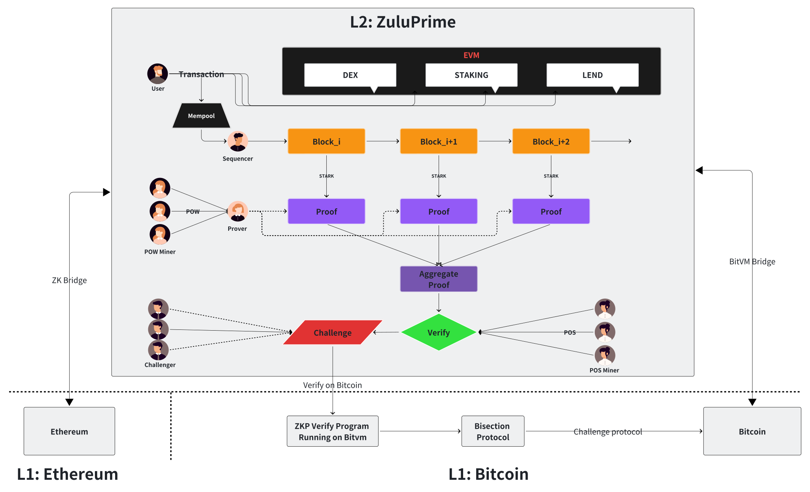

# ZuluPrime: Smart Contracts

ZuluPrime is a layer 2 rollup that uses zero-knowledge proofs to scale Bitcoin without compromising on security or
decentralization.

## 🏛 Architecture

## Q&A

| Question                                                | Resource                                                         |
| ------------------------------------------------------- | ---------------------------------------------------------------- || What do I need to develop the project locally?          | [development.md](docs/guides/development.md)                     |
| How can I set up my dev environment?                    | [setup-dev.md](docs/guides/setup-dev.md)                         |
| How can I run the project?                              | [launch.md](docs/guides/launch.md)                               |
| What is the logical project structure and architecture? | [architecture.md](docs/guides/architecture.md)                   |
| Where can I find protocol specs?                        | [specs](docs/specs/README.md)                                    |
| Where can I find developer docs?                        | [docs](https://docs.zulunetwork.io/introduction/welcome-to-zulu) |

## Acknowledge
ZuluPirme leverages the power of [`zkStack`](https://github.com/matter-labs/zksync-era) from [Matter Labs](https://github.com/matter-labs). 

